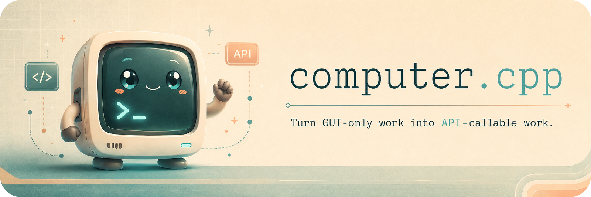

# computer.cpp

[](LICENSE)


Most software was not built for agents.

It was built for humans staring at windows.

A human can open an app, understand what is on screen, click the right thing,
type the right text, wait for the UI to settle, and verify that the job is
done.

Agents need tools, APIs, schemas, results, and something callable. Most desktop
apps do not provide that.

`computer.cpp` gives agents the missing bridge.

Write one Lua file that describes what a desktop app can do:

```text
add-reminder
complete-reminder
summarize-list
extract-visible-rows
approve-invoice
update-customer-record
submit-form
```

`computer.cpp` turns that into:

```text
CLI commands
local HTTP endpoints
typed input and output schemas
sync and async operations
progress updates
cancellation
trace logs
screenshots and artifacts
bounded model tool calls
agent-friendly MCP server
```

The desktop app does not need to expose an API. The app vendor does not need to
ship an SDK. The workflow does not need to live in a browser.

If a human can operate it on screen, `computer.cpp` can help make it
programmable.

## Table Of Contents

- [The Magic](#the-magic)
- [What Actually Happens](#what-actually-happens)
- [Why This Exists](#why-this-exists)
- [Desktop Apps For Agents](#desktop-apps-for-agents)
- [CLI, HTTP, And MCP](#cli-http-and-mcp)
  - [CLI](#cli)
  - [Local HTTP API](#local-http-api)
  - [MCP Server](#mcp-server)
- [Examples](#examples)
- [Quick Start](#quick-start)
- [Define An App API](#define-an-app-api)
- [Operations](#operations)
- [Micro-Agents](#micro-agents)
- [Core Desktop Control](#core-desktop-control)
- [LLM Configuration](#llm-configuration)
  - [CLI and TOML](#cli-and-toml)
  - [Tray Settings](#tray-settings)
- [Lua Scripts](#lua-scripts)
- [Protocol](#protocol)
- [Tracing And Artifacts](#tracing-and-artifacts)
- [Security Model](#security-model)
- [Why C++?](#why-c)
- [Project Status](#project-status)
- [Alternatives And Comparisons](#alternatives-and-comparisons)
- [Philosophy](#philosophy)
- [Community And Contributions](#community-and-contributions)
- [Stargazers](#stargazers)
- [License](#license)

## The Magic

The outside world sees a clean command:

```http
POST /commands/add-reminder
```

Inside, `computer.cpp` can run a tiny desktop micro-agent that sees the screen
and uses bounded keyboard, mouse, screenshot, and app-specific tools.

```lua
local ac = require("computer_cpp")

local app = ac.app.define({
  name = "mac.reminders",
  title = "macOS Reminders",
  version = "1.0.0",
})

local add_reminder_agent = ac.micro_agent.define({
  name = "reminders.add",
  system = [[
You operate the visible macOS Reminders window.

Add the requested reminder and verify that it appears.
Use only screenshots and the provided tools.
Click, type, wait, and verify from visible screen evidence.
Call blocked if the screen is not usable.
]],
  tools = {
    ac.tools.screenshot({ focusApp = "Reminders", frontmostWindowOnly = true }),
    ac.tools.click_box({ focusApp = "Reminders" }),
    ac.tools.type_text({ focusApp = "Reminders" }),
    ac.tools.press_key({ focusApp = "Reminders" }),
    ac.tools.wait_stable(),
    ac.tools.blocked(),

    ac.tool.define("confirm_created", {
      description = "Confirm the requested reminder is visible",
      input = {
        title = { type = "string", required = true },
        evidence = { type = "string", required = true },
      },
    }),
  },
})

app:command("add-reminder", {
  description = "Add a reminder to a list",
  input = {
    list = { type = "string", required = true },
    title = { type = "string", required = true },
    notes = { type = "string", default = "" },
  },
  output = {
    created = { type = "boolean" },
    title = { type = "string" },
    evidence = { type = "string" },
  },
  handler = function(ctx, args)
    ac.app.launch("Reminders")
    ac.wait_frontmost("Reminders", { timeoutMs = 5000 })

    local evidence = nil
    local result = add_reminder_agent:run_loop(ctx, {
      goal = "Add reminder: " .. args.title,
      max_steps = 12,
      state = args,
      on_tool_call = {
        confirm_created = function(call)
          if call.args.title ~= args.title then
            return ac.tool_result.error({
              code = "wrong_title",
              message = "Visible reminder title did not match",
            })
          end
          evidence = call.args.evidence
          return ac.tool_result.done({ created = true })
        end,
      },
    })

    if not result.ok then
      error(result.error and result.error.message or "add reminder failed")
    end

    return {
      created = true,
      title = args.title,
      evidence = evidence,
    }
  end,
})

return app
```

From that one file:

```bash
computer.cpp app run ./reminders.lua add-reminder \
  --list Today \
  --title "Review release notes"
```

```http
POST /commands/add-reminder
```

```http
POST /mcp
```

The MCP server generates agent-friendly tools from the same Lua app definition,
so the desktop app can be exposed through CLI, HTTP, and MCP without writing a
custom server for each app.

Now Reminders is not just a GUI app. It is a command-line tool and a local HTTP
API, and an MCP server agents can use.

## What Actually Happens

The command looks simple:

```text
add-reminder("Today", "Review release notes")
```

The runtime can do the messy desktop work underneath:

```text
focus the app
take a screenshot
ask the model what it sees
click the toolbar plus button
type the title
wait for the UI to settle
take another screenshot
verify the reminder is visible
return a typed result
save the trace
```

The model does not get arbitrary control. It gets bounded tools. The Lua
command owns the schema, state, validation, retries, progress, final result, and
proof.

The caller never sees:

```text
click(...)
type(...)
screenshot(...)
scroll(...)
```

The caller sees:

```text
add-reminder(...)
complete-reminder(...)
summarize-list(...)
extract-visible-rows(...)
approve-invoice(...)
```

`computer.cpp` does not merely automate desktop apps. It turns desktop apps into
programmable infrastructure.

## Why This Exists

There is a huge amount of useful software that agents cannot directly use. Not
because the software is impossible to operate, but because it was built for
humans.

A person can sit in front of a screen and work through:

```text
a native productivity app
a finance system
a medical scheduling app
a thick-client enterprise tool
a remote desktop workflow
an installer
an internal operations console
a legacy application with no API
```

An agent needs a callable interface. `computer.cpp` creates that interface. It
wraps GUI-only work behind commands, schemas, results, traces, and operations.

The implementation can be ugly. The API should not be.

## Desktop Apps For Agents

AI agents are good at calling tools. Most desktop apps are not tools. They are
human interfaces.

`computer.cpp` turns a desktop app into something an agent can use:

```text
desktop app
-> Lua app definition
-> CLI / HTTP / MCP
-> agent-callable API
```

An agent can call:

```text
add-reminder(list="Today", title="Review release notes")
```

instead of trying to reason about:

```text
take screenshot
find plus button
click coordinate
type title
press escape
take another screenshot
verify visually
```

The second sequence may still happen internally. The agent sees the first one.

## CLI, HTTP, And MCP

`computer.cpp` exposes the same desktop app API in multiple ways.

### CLI

Use the CLI for local automation, scripts, tests, and agents that call shell
commands:

```bash
computer.cpp app run ./reminders.lua add-reminder \
  --list Today \
  --title "Review release notes"
```

### Local HTTP API

Use HTTP when you want a normal local service interface:

```http
GET  /health
GET  /schema
POST /commands/add-reminder
POST /commands/add-reminder?async=true
GET  /operations/op_123
GET  /operations/op_123/result?wait=30
POST /operations/op_123:cancel
```

When binding outside localhost, `app serve` requires `--auth-token-env` so the
HTTP API is not exposed without a bearer token.

### MCP Server

[MCP](https://modelcontextprotocol.io/) is becoming a standard way for agents to
discover and call tools.

`app serve` also exposes a Streamable HTTP MCP endpoint at `/mcp`. The endpoint
uses JSON-RPC over HTTP POST and returns JSON responses. It does not require TLS
itself; put Caddy or another reverse proxy in front when exposing it over
HTTPS.

The MCP endpoint is stateless: it does not allocate MCP session ids and does
not open SSE streams. MCP GET requests to `/mcp` return `405 Method Not
Allowed`; clients should use the JSON response path over HTTP POST.

```bash
computer.cpp app serve ./reminders.lua --listen 127.0.0.1:8787
```

```http
POST /mcp
```

The MCP server turns a Lua app definition into app-level tools such as:

```text
add-reminder
complete-reminder
summarize-list
```

instead of raw desktop primitives like:

```text
click
type
screenshot
scroll
```

Supported MCP methods include:

```text
initialize
notifications/initialized
ping
tools/list
tools/call
```

The MCP tool schemas come from the command `input` and `output` schemas in the
Lua app definition. Tool calls return both `structuredContent` and a JSON text
content block for clients that prefer either form.

HTTP MCP requests should include:

```text
Accept: application/json, text/event-stream
Content-Type: application/json
MCP-Protocol-Version: 2025-11-25
```

`MCP-Protocol-Version` is negotiated by `initialize` and should be sent on
subsequent requests. The server supports the current `2025-11-25` revision and
keeps compatibility with `2025-06-18` and `2025-03-26` clients for the tool
surface implemented here.

When exposing `/mcp` through a reverse proxy, set a bearer token and allow the
browser origins that should be able to reach the endpoint:

```bash
export COMPUTER_CPP_APP_TOKEN='change-me'
computer.cpp app serve ./reminders.lua \
  --listen 127.0.0.1:8787 \
  --auth-token-env COMPUTER_CPP_APP_TOKEN \
  --allowed-origin https://mcp.example.com
```

The source of truth is the Lua app definition:

```text
one Lua app definition
-> CLI
-> HTTP API
-> MCP server
-> async operations
-> schemas
-> traces
```

## Examples

Personal productivity:

```http
POST /commands/add-reminder
POST /commands/complete-reminder
POST /commands/summarize-list
```

Business operations:

```http
POST /commands/extract-visible-invoices
POST /commands/approve-invoice
POST /commands/update-customer-record
POST /commands/export-report
```

Internal tools:

```http
POST /commands/open-case
POST /commands/summarize-visible-record
POST /commands/fill-required-fields
POST /commands/submit-form
```

These are not generic computer-use actions. They are app APIs.

## Quick Start

On macOS, create a reusable local signing identity before the first build if
you do not already have an Apple Development or Developer ID Application
certificate:

```bash
./scripts/create-local-codesign-identity.sh
```

Build:

```bash
cmake -S . -B build/debug -DCMAKE_BUILD_TYPE=Debug -DBUILD_TESTING=ON
cmake --build build/debug
ctest --test-dir build/debug --output-on-failure
```

The debug binary is written to:

```bash
build/debug/computer.cpp
```

On macOS, the tray app also needs a stable code-signing identity before asking
for Accessibility and Screen Recording permissions. TCC records permissions
against the app's code identity, so rebuilding with a different ad-hoc or
regenerated certificate can leave stale privacy rows or prevent the app from
appearing in System Settings.

The script is intentionally idempotent. If `ComputerCpp Local Code Signing`
already exists in the login keychain, it reuses that identity instead of
generating a new one. That keeps the local TCC identity stable across rebuilds.

`COMPUTER_CPP_CODE_SIGN_IDENTITY=auto` is the default. On macOS it prefers an
Apple Development or Developer ID Application certificate when one is available,
then falls back to `ComputerCpp Local Code Signing`, and finally to ad-hoc
signing. Ad-hoc signing is not recommended for macOS permission onboarding.

Launch the tray app from the build directory:

```bash
open -n build/debug/computer.cpp
```

Use the tray menu's `Permissions` item to grant and verify macOS permissions.
The panel has separate rows for Accessibility and Screen Recording:

1. Click `Request` in the Accessibility row. macOS opens Privacy & Security.
   Enable `ComputerCpp`, return to the permission panel, then click `Test`.
2. Click `Request` in the Screen Recording row. If macOS does not add
   `ComputerCpp` automatically, use the `+` button in Screen Recording and
   select the running build artifact shown below. Return to the permission panel
   and click `Test`.
3. When both rows are granted, use `Restart ComputerCpp` if macOS asks for a
   restart. If the permissions get wedged after rebuilds, use
   `Reset Permissions && Restart`.

After granting Screen Recording, macOS may ask to quit and reopen the app. If
the app does not visibly return, check the tray icon or run:

```bash
pgrep -af ComputerCpp
./build/debug/computer.cpp permissions
```

If Screen Recording does not add `ComputerCpp` to the list, use the `+` button
in System Settings and select the running build artifact:

```text
build/debug/ComputerCpp.app
```

If permissions get stuck after changing bundle paths, bundle ids, or signing
identities, quit the tray app and do a service-wide reset for the two privacy
services before trying again:

```bash
pkill -x ComputerCpp 2>/dev/null || true
tccutil reset Accessibility
tccutil reset ScreenCapture
open -n build/debug/ComputerCpp.app
```

For a public downloadable macOS binary, use Developer ID signing and
notarization. The self-signed identity is for local source builds; it is not a
replacement for Developer ID distribution.

Check permissions and capabilities:

```bash
./build/debug/computer.cpp permissions
./build/debug/computer.cpp capabilities
```

Run the macOS Reminders example schema:

```bash
./build/debug/computer.cpp --json app run examples/mac/reminders.lua
```

Run a command:

```bash
./build/debug/computer.cpp --json app run examples/mac/reminders.lua \
  add-reminder \
  --list Today \
  --title "Review release notes"
```

Serve it over HTTP:

```bash
./build/debug/computer.cpp app serve examples/mac/reminders.lua \
  --listen 127.0.0.1:8787
```

Call it:

```bash
curl -X POST http://127.0.0.1:8787/commands/add-reminder \
  -H 'Content-Type: application/json' \
  -d '{"list":"Today","title":"Review release notes"}'
```

Use it as an MCP server:

```bash
curl -X POST http://127.0.0.1:8787/mcp \
  -H 'Accept: application/json, text/event-stream' \
  -H 'Content-Type: application/json' \
  -d '{"jsonrpc":"2.0","id":1,"method":"initialize","params":{"protocolVersion":"2025-11-25","capabilities":{},"clientInfo":{"name":"curl","version":"1.0.0"}}}'
```

See [examples/mac](examples/mac) for a complete macOS Reminders API that lists,
adds, completes, and summarizes reminders through the real desktop app.

## Define An App API

A `computer.cpp` app is a Lua file that returns an app definition.

```lua
local ac = require("computer_cpp")

local app = ac.app.define({
  name = "demo.notes",
  title = "Demo Notes",
  version = "1.0.0",
  description = "Desktop API for a notes app.",
})

app:command("create-note", {
  description = "Create a note",
  input = {
    title = { type = "string", required = true },
    body = { type = "string", default = "" },
  },
  output = {
    created = { type = "boolean" },
    title = { type = "string" },
  },
  handler = function(ctx, args)
    ctx:progress({ step = "opening_app" })

    -- Use snapshots, clicks, typing, screenshots, deterministic Lua,
    -- or bounded model tool-call loops here.
    return {
      created = true,
      title = args.title,
    }
  end,
})

return app
```

Run a command from the CLI:

```bash
computer.cpp app run ./notes.lua create-note \
  --title "Draft release note" \
  --body "..."
```

Or serve the app as a local HTTP API:

```bash
computer.cpp app serve ./notes.lua --listen 127.0.0.1:8787
curl http://127.0.0.1:8787/schema
curl -X POST http://127.0.0.1:8787/commands/create-note \
  -H 'Content-Type: application/json' \
  -d '{"title":"Draft release note","body":"..."}'
```

Or expose it as an MCP server through the same HTTP service:

```bash
curl -X POST http://127.0.0.1:8787/mcp \
  -H 'Accept: application/json, text/event-stream' \
  -H 'Content-Type: application/json' \
  -H 'MCP-Protocol-Version: 2025-11-25' \
  -d '{"jsonrpc":"2.0","id":2,"method":"tools/list","params":{}}'
```

From this one definition, `computer.cpp` can generate:

```text
CLI help
CLI argument parsing
HTTP schema
HTTP input validation
HTTP output validation
command dispatch
sync execution
async execution
operation storage
progress updates
trace logging
MCP tool schemas
MCP server dispatch
```

The MCP server uses the same command definitions as the CLI and HTTP surfaces.

## Operations

Commands can run synchronously or asynchronously.

Sync is default:

```bash
computer.cpp app run ./app.lua summarize-visible-items --limit 20
```

Async is explicit:

```bash
computer.cpp app run ./app.lua summarize-visible-items --limit 20 --async
```

Inspect async operations from the CLI:

```bash
computer.cpp app operation get ./app.lua op_01jabc
computer.cpp app operation result ./app.lua op_01jabc --wait 30
computer.cpp app operation cancel ./app.lua op_01jabc
```

HTTP follows the same model:

```http
POST /commands/summarize-visible-items
POST /commands/summarize-visible-items?async=true
GET  /operations/op_01jabc
GET  /operations/op_01jabc/result?wait=30
POST /operations/op_01jabc:cancel
```

Statuses are:

```text
pending
running
succeeded
failed
cancelled
```

Long-running desktop work should be inspectable, cancellable, traceable, and
easy to call.

## Micro-Agents

`computer.cpp` supports small, bounded model-driven loops for narrow desktop
tasks.

A micro-agent is not a general planner. It does one thing:

```text
read visible rows
extract candidate cards
identify the active modal
verify that a record was saved
find the submit button
```

Micro-agents use real model tool calls with JSON schemas. They can call
standard tools like:

```text
screenshot
click_box
scroll_down
scroll_up
press_key
type_text
wait
wait_stable
done
blocked
```

They can also report semantic app-specific data through tools like:

```text
report_visible_rows
report_invoice_fields
report_visible_state
confirm_saved_record
```

The model does not return fake JSON in normal text. It calls real tools.
`computer.cpp` validates the arguments, dispatches the tools, records the trace,
and returns tool results.

## Core Desktop Control

`computer.cpp` is also a local desktop automation daemon and CLI. It exposes a
small JSON protocol for desktop control on macOS, Linux, and Windows:
accessibility snapshots, screenshots, input, window management, leases,
clipboard access, image utilities, and optional LLM calls.

Desktop-affecting commands are protected by a control-session lease. Acquire a
lease directly or run a command under `session run`:

```bash
computer.cpp session acquire --owner local --purpose smoke
computer.cpp session run --owner local --purpose smoke -- /bin/echo ok
```

Targets are resolved through one of these forms:

```text
@ref
point:x,y
rect:left,top,right,bottom
role:button[name="Save"]
```

Use `snapshot --with-bounds` and `target find role ...` to discover actionable
accessibility refs.

Common commands:

```bash
computer.cpp ping
computer.cpp capabilities
computer.cpp schema
computer.cpp permissions
computer.cpp state
computer.cpp snapshot --interactive --with-bounds
computer.cpp screenshot /tmp/screen.png --max-dim 1200
computer.cpp image info /tmp/screen.png
computer.cpp image split /tmp/tall.png --chunk-height 900 --overlap 80
```

Input and window commands:

```bash
computer.cpp click @e1
computer.cpp click point:500,400
computer.cpp click rect:10,20,110,70
computer.cpp mouse move 500 400 --duration-ms 250
computer.cpp mouse drag 100 100 300 300 --button left
computer.cpp scroll -600 0 --at role:scrollarea
computer.cpp press "Cmd+L"
computer.cpp type "hello" --paste
computer.cpp window list Finder
computer.cpp window bounds 100 100 1200 800
```

Observation commands record input events and sampled screenshot frames:

```bash
computer.cpp observe events 20
computer.cpp observe frames last 10
```

Wait commands support app focus and screen stability:

```bash
computer.cpp wait --frontmost Finder --timeout-ms 5000
computer.cpp wait --stable-screen 750 --timeout-ms 5000
```

Clipboard commands:

```bash
computer.cpp clipboard read
computer.cpp clipboard write "hello"
computer.cpp clipboard paste
```

## LLM Configuration

LLM calls use one canonical user config file. The tray settings window and the
`computer.cpp config` CLI commands both edit the same `config.toml`.

### CLI and TOML

```bash
computer.cpp config path
computer.cpp config init
computer.cpp config set-provider openrouter --type openrouter --api-key-stdin
computer.cpp config set-profile main --provider openrouter --model openai/gpt-4.1-mini \
  --temperature 0.2 --max-output-tokens 1200 --default
computer.cpp config test
```

Use `computer.cpp config open` to open the editable TOML file. The config stores
providers, profiles, model ids, timeouts, sampling defaults, OpenRouter routing
preferences, and provider API keys. `config show` redacts keys, and the file is
created in the platform user config directory. On macOS/Linux it is written
owner-read/write only.

A minimal OpenRouter config looks like this:

```toml
version = 1
default_profile = "openrouter"

[providers.openrouter]
type = "openrouter"
base_url = "https://openrouter.ai/api/v1"
api_key = "replace-with-your-key"

[profiles.openrouter]
provider = "openrouter"
model = "openai/gpt-4.1-mini"
temperature = 0.2
max_output_tokens = 1200
timeout_ms = 180000

[profiles.openrouter.openrouter.provider]
allow_fallbacks = true
order = ["openai"]
```

For a local or OpenAI-compatible endpoint, use `type = "openai-compatible"` and
set `base_url` to the endpoint's `/v1` URL. Omit `api_key` when the endpoint is
local or otherwise does not require a key.

Legacy LLM environment variables are only a one-time import path:

```bash
computer.cpp config import-env
```

After import, edit the config file, tray settings, or `computer.cpp config`
commands instead of setting env vars at launch time.

### Tray Settings

Launch the tray app and choose `Settings...` from the tray menu. The settings
window edits the same `config.toml` file:

- `Providers` defines endpoint names, provider type, base URL, and API key.
  Choose `OpenRouter` for `https://openrouter.ai/api/v1`, or
  `OpenAI-compatible` for local and compatible `/v1` endpoints. Check
  `No API key required` for local endpoints that accept unauthenticated calls.
- `Profiles` defines the active model settings. Pick a provider, set the model
  id, optional temperature, top-p, max token, timeout, extra request params, and
  optional OpenRouter routing JSON. Use `Set Active` to make a profile the
  default and `Test Inference` to verify it.
- `Config` shows the config file path. `Open Config` opens the TOML file in the
  default editor, `Reload` discards unsaved UI changes, and `Save Changes`
  writes the TOML file.

## Lua Scripts

Lua scripts can call the same daemon surface through `ac`:

```lua
local ac = require("computer_cpp")

ac.snapshot({ interactive = true, bounds = true })
ac.click("role:button[name=\"Save\"]")
ac.wait_frontmost("Finder", { timeoutMs = 5000 })
ac.screenshot("/tmp/screen.png", { maxDimension = 1200 })
```

Run scripts with:

```bash
computer.cpp run --owner local --purpose script ./script.lua
computer.cpp run --dry-run ./script.lua
```

## Protocol

Requests are JSON objects with a `method` and optional `params`. Responses use
`ok`, `data`, `error`, and `code` fields.

```json
{"method":"ping","params":{}}
```

Batch requests run multiple steps through the same control-session gate:

```bash
printf '[{"method":"ping","params":{}}]' | computer.cpp --json batch
```

## Tracing And Artifacts

Every app command execution can be traceable.

A trace may include:

```text
command input
progress updates
screenshots
model requests
model tool calls
tool results
desktop actions
final result
error or cancellation
timing
artifacts
```

Normal command results should stay small. Traces and artifacts are for
debugging, verification, replay, and improving app wrappers.

Use `--trace` to include an execution trace in JSON output, or `--trace-dir` to
write the trace as JSONL:

```bash
computer.cpp --json app run ./app.lua command-name --trace
computer.cpp --json app run ./app.lua command-name --trace-dir ./traces
```

## Security Model

`computer.cpp` is a local automation tool, not a remote SaaS control plane.

Default posture:

```text
local daemon
local socket
localhost HTTP by default
desktop-control leases
explicit permissions
traceable operations
auth required when binding beyond localhost
```

Important notes:

```text
A process with a control-session token can perform real desktop actions.
Localhost HTTP serving is intended for local development/control.
Do not expose the HTTP server broadly without authentication and a proper network boundary.
Screenshots and traces may contain sensitive data.
Model-backed commands may send screenshots or text to a configured model provider.
```

The tool is powerful because it can operate the real desktop. Use it with the
same care you would use for any local automation system that can click, type,
read screenshots, and access the clipboard.

## Why C++?

This project has to touch the real computer.

Screenshots, input injection, window state, accessibility snapshots, clipboard
behavior, display geometry, native app focus, and desktop permissions all live
at the operating system boundary.

A CMake-based C++ project can compile close to the metal, link directly against
OS APIs, and run as a small local binary. On macOS, desktop automation means
talking to frameworks like AppKit, CoreGraphics, Accessibility,
ScreenCaptureKit, and the system clipboard. On Linux, it can mean X11, XTest,
Wayland/KWin helpers, desktop portals, or other platform-specific adapters. On
Windows, it means Win32, UI Automation, input APIs, window handles, sessions,
and desktop permissions.

Lua sits on top because app APIs need to be easy to define. C++ sits underneath
because the computer has to actually move.

## Project Status

Current implementation status:

```text
macOS: primary and most complete backend
Linux: adapter work exists; support is partial and depends on native dependencies
Windows: adapter work exists; support is evolving
MCP: supported through Lua app definitions
```

The current macOS backend includes native desktop control, permissions,
screenshots, accessibility snapshots, window/app state, input actions, optional
LLM calls, Lua app definitions, local HTTP serving, async operation records,
MCP serving, tracing, and the Reminders example.

Linux and Windows support should be treated as evolving.

## Alternatives And Comparisons

### Cua vs computer.cpp

[Cua](https://github.com/trycua/cua) is a broader computer-use stack for agents.
It includes components for controlling desktops, working with sandboxes,
exposing tools, running agents, and building computer-use workflows.

Cua asks:

```text
How do we give agents access to computers?
```

`computer.cpp` asks:

```text
How do we turn this desktop app or workflow into a callable API?
```

A Cua-style system gives an agent ways to inspect and operate a computer:
windows, screenshots, accessibility state, mouse, keyboard, tools, and
execution environments.

`computer.cpp` lets a developer wrap a specific desktop app as a semantic API:

```http
POST /commands/add-reminder
POST /commands/approve-invoice
POST /commands/extract-visible-rows
GET  /operations/op_123/result
```

The app may still be controlled through screenshots, clicks, typing, keyboard
shortcuts, accessibility snapshots, or model vision internally. Those details
stay behind the command boundary.

The public interface is not "click this coordinate."

The public interface is "perform this app operation."

Cua gives agents computers.

`computer.cpp` gives desktop apps APIs.

They can be complementary: a lower-level computer-use driver can provide
desktop control, while `computer.cpp` defines the semantic app contract,
schemas, operations, traces, and API surface.

### PyAutoGUI vs computer.cpp

[PyAutoGUI](https://github.com/asweigart/pyautogui) is a classic Python desktop
automation library. It can move the mouse, type text, press keys, take
screenshots, and locate images on screen.

That is low-level desktop scripting.

`computer.cpp` lets developers wrap a GUI app as a typed command surface.

PyAutoGUI-style code says:

```python
click(x, y)
write("hello")
press("enter")
```

`computer.cpp` says:

```http
POST /commands/add-reminder
```

The implementation may still click, type, wait, and screenshot internally. The
caller gets a semantic command and a typed result.

PyAutoGUI helps you automate a screen.

`computer.cpp` helps you publish an API for a desktop workflow.

### SikuliX vs computer.cpp

[SikuliX](https://sikulix.github.io/) is a visual automation tool built around
image recognition: find this image, click that region, wait for the UI to
change.

That can be useful for visual desktop automation and GUI testing.

`computer.cpp` can use visual information too, but not as the public
abstraction.

A visual macro is usually a sequence of UI actions.

A `computer.cpp` app definition is an API contract:

```lua
app:command("summarize-visible-items", {
  input = {
    limit = { type = "integer", default = 20 },
  },

  output = {
    items = { type = "array" },
    summary = { type = "string" },
  },

  handler = function(ctx, args)
    return my_app.summarize_visible_items(ctx, args)
  end,
})
```

From that one definition, `computer.cpp` can provide:

```bash
computer.cpp app run ./my-app.lua summarize-visible-items --limit 20
```

and:

```http
POST /commands/summarize-visible-items
```

Visual macros automate steps.

`computer.cpp` defines callable app behavior.

### AutoHotkey vs computer.cpp

[AutoHotkey](https://www.autohotkey.com/) is excellent for Windows hotkeys,
macros, and personal automation.

It is great when a human wants to customize their own machine.

`computer.cpp` is aimed at a different layer: turning desktop workflows into
programmatic APIs that agents, scripts, and services can call.

AutoHotkey scripts typically expose behavior through hotkeys or script entry
points.

`computer.cpp` exposes behavior through typed commands, schemas, CLI, HTTP, MCP,
async operations, and traceable results.

AutoHotkey is personal automation.

`computer.cpp` is an app API runtime.

### agent-computer-use vs computer.cpp

[agent-computer-use](https://github.com/kortix-ai/agent-computer-use), also
known as `agent-cu`, focuses on accessibility-based desktop automation.

Accessibility-first tools are useful when the target app exposes a reliable
accessibility tree. They can provide deterministic element references, labels,
roles, and structured UI state.

Accessibility is powerful when it works.

But many real workflows involve apps or surfaces where accessibility is
incomplete, stale, misleading, unavailable, or simply not the right abstraction:

```text
custom-rendered UIs
remote desktops
legacy enterprise software
canvas apps
installers
GPU-heavy views
broken Electron apps
mixed workflows across multiple apps
```

`computer.cpp` can use accessibility snapshots internally when they help.

But it does not require the public API to mirror the accessibility tree.

The goal is not to expose UI elements.

The goal is to expose useful app operations:

```http
POST /commands/extract-visible-invoices
POST /commands/approve-invoice
POST /commands/update-customer-record
```

The implementation can use accessibility, screenshots, keyboard shortcuts,
model vision, or direct input.

The caller should not care.

### NIB / nut.js vs computer.cpp

[nut.js](https://github.com/nut-tree/nut.js) and
[NIB](https://nutjs.dev/nib) provide desktop automation tools for mouse,
keyboard, screen, windows, and agent-facing CLI usage.

They are useful when you want a JavaScript or Node-oriented desktop automation
stack.

`computer.cpp` has a different center of gravity.

It is not a Node package and not just an agent CLI for desktop actions.

It is a C++ desktop app API runtime.

The goal is not only:

```text
let an agent click and type
```

The goal is:

```text
let a developer define a semantic API for a desktop app
```

That API can then be exposed through CLI, HTTP, and MCP with schemas,
operations, results, traces, and artifacts.

### computer-use-mcp vs computer.cpp

[computer-use-mcp](https://github.com/zavora-ai/computer-use-mcp) is an MCP
server/client for controlling a desktop computer with AI agents. It exposes
tools like screenshots, mouse, keyboard, clipboard, app management, and window
targeting.

That is useful when your primary goal is MCP-based computer control.

`computer.cpp` exposes MCP too, but MCP is not the core abstraction.

The core abstraction is the app API definition.

```text
one Lua file
-> semantic commands
-> CLI
-> HTTP
-> MCP
-> async operations
-> traces
```

`computer-use-mcp` exposes computer-control tools to agents.

`computer.cpp` helps developers expose app-specific commands to agents.

Agents should not always be asked to operate a desktop at the level of pixels
and clicks.

They should be able to call:

```text
approve-invoice
extract-visible-rows
summarize-list
complete-reminder
```

### Playwright / Puppeteer / Selenium vs computer.cpp

Browser automation tools are the right answer when the workflow lives inside a
browser and the DOM or browser protocol is available.

Examples:

* [Playwright](https://playwright.dev/)
* [Puppeteer](https://pptr.dev/)
* [Selenium](https://www.selenium.dev/)
* [browser-use](https://github.com/browser-use/browser-use)
* [agent-browser](https://github.com/vercel-labs/agent-browser)

Use browser automation for browser-native work.

Use `computer.cpp` when the workflow lives on the desktop:

```text
native apps
desktop software
system dialogs
installers
remote desktops
legacy enterprise tools
custom internal applications
apps with no official API
mixed workflows across multiple apps
personal productivity apps
```

Browser automation gives you a browser API.

`computer.cpp` helps you build APIs for GUI workflows that do not already have
one.

### OpenAI / Anthropic computer use vs computer.cpp

Model providers increasingly expose computer-use capabilities.

Examples:

* [OpenAI computer use](https://platform.openai.com/docs/guides/tools-computer-use)
* [Anthropic computer use](https://docs.anthropic.com/en/docs/agents-and-tools/tool-use/computer-use-tool)

Those systems help models reason about screens and produce actions.

`computer.cpp` is different.

It is the local runtime for making desktop workflows callable, traceable, and
reusable.

A model may be used inside a `computer.cpp` command, but the public contract is
still the app command:

```http
POST /commands/summarize-visible-items
```

not:

```text
here is a screenshot, decide what to click next
```

Model computer use is a reasoning capability.

`computer.cpp` is an app API layer for real desktop software.

### UiPath / Power Automate / traditional RPA vs computer.cpp

Traditional RPA platforms such as [UiPath](https://www.uipath.com/),
[Microsoft Power Automate](https://www.microsoft.com/en-us/power-platform/products/power-automate),
[Automation Anywhere](https://www.automationanywhere.com/), and
[Blue Prism](https://www.blueprism.com/) are full workflow systems.

They often include recorders, schedulers, credential vaults, queues, dashboards,
approvals, governance, and enterprise administration.

`computer.cpp` is smaller and more developer-native.

It does not try to be a full RPA platform.

It gives developers a runtime for defining semantic commands over desktop
workflows, then exposing them through CLI, HTTP, and MCP.

RPA asks:

```text
How do we manage a fleet of business-process bots?
```

`computer.cpp` asks:

```text
How do we turn this desktop app or workflow into a callable API?
```

That makes it useful as a local substrate, an agent tool, an internal
automation layer, or the foundation for more opinionated systems.

### Bespoke Agents vs computer.cpp

Bespoke agents are powerful. For hard workflows, specific code often beats
generic frameworks.

`computer.cpp` preserves that.

The app logic is still bespoke. The Lua file can define exactly how one app or
workflow should behave.

But `computer.cpp` standardizes the boring parts:

```text
CLI
HTTP server
MCP server
input validation
output validation
operation ids
async execution
result retrieval
cancellation
progress updates
trace logs
screenshots
artifacts
model tool calling
standard desktop tools
```

So each app can be custom where it matters, without rebuilding the runtime
every time.

Bespoke behavior.

Standard runtime.

### Raw Desktop Endpoints vs computer.cpp

A desktop automation server could expose endpoints like:

```http
POST /click
POST /type
POST /scroll
POST /screenshot
```

`computer.cpp` intentionally avoids that as the default public API.

Raw desktop primitives are internal tools.

The public API should describe what the app does:

```http
POST /commands/add-reminder
POST /commands/complete-reminder
POST /commands/extract-visible-rows
POST /commands/approve-invoice
```

This makes the API stable even if the implementation changes.

Today a command might use screenshots and mouse clicks.

Tomorrow it might use keyboard shortcuts, accessibility, a model tool call, or a
better app-specific strategy.

The caller should not care.

## Philosophy

The API is semantic.

The implementation can be ugly.

Desktop apps are messy. They have modals, weird focus behavior, stale screens,
broken accessibility trees, remote views, unexpected dialogs, and no official
APIs.

`computer.cpp` gives developers a way to wrap that mess in a clean command
surface:

```text
define the app API once
expose it through CLI, HTTP, and MCP
trace every operation
keep low-level desktop tools internal
turn GUI-only work into API-callable work
```

## Community And Contributions

If you are building desktop agents, app wrappers, local automation tools, or
computer-use infrastructure, you are invited to build with us.

You can absolutely build your own thing on top of `computer.cpp`. The reason to
contribute reusable pieces upstream is leverage.

When a fix or helper lands here, you no longer have to carry it alone. Other
people can test it on platforms, displays, apps, and edge cases you do not have.
Your work becomes part of the shared runtime, your use case influences the
direction of the project, and your contribution becomes visible proof of the
problem you solved.

That is good for you and good for the project:

```text
less private maintenance
more review and testing
public credit for useful work
a stronger foundation for your own products
faster progress on the boring runtime layer
more time for the app-specific work that makes your project unique
```

The best place to compete is at the product and workflow layer. The best place
to cooperate is the substrate: screenshots, input, accessibility, leases, app
schemas, operation tracking, MCP, HTTP, traces, and cross-platform desktop
behavior.

Good contributions include:

```text
Lua app definitions for real desktop apps
platform backend fixes
better accessibility targeting
more reliable screenshot and input behavior
MCP, HTTP, and CLI improvements
docs, examples, and tests
bug reports with clear reproduction steps
small helper APIs that remove repeated wrapper code
```

Private workflows can stay private. If you automate an internal app, you may not
be able to share the app logic, screenshots, or data. That is fine. The reusable
parts are still valuable: selectors, retries, validation helpers, trace patterns,
micro-agent tools, platform fixes, and lessons learned from real failure modes.

Open a pull request, start a discussion, or publish a small example. If you are
building something adjacent, the door is open. A healthier desktop-agent
ecosystem is one where independent projects can still improve the common pieces
together.

## Stargazers

[](../../stargazers)

If this project helps, star the repository so other people can find it.

## License

MIT. See [LICENSE](LICENSE).
